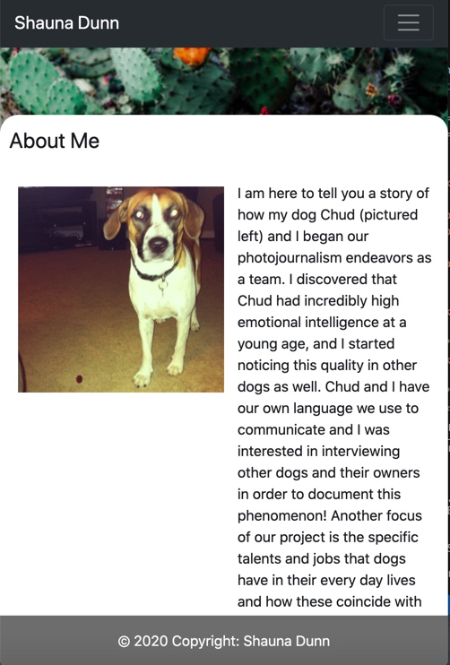
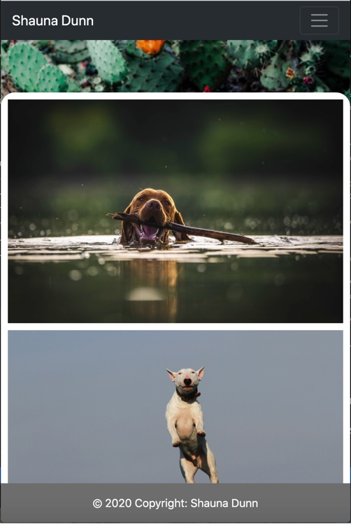

# CSS-Bootstrap-Portfolio

This website is a showcasing of the artists' work in three navigable parts: a home/about page, a contact page, and a portfolio image gallery page.  The construction of this website utilizes the Bootstrap framework, in particular the grid system and flex-box properties.  The end goal of this project was to have a layout that is responsive to different screen sizes ranging from a cellphone (400px) to a desktop (992px).  This project was a learning experience of trial and error which required much research into Bootstrap and how it is implemented.  The main setbacks with my final project is the look of the site on cellphone size screens.  I was unable to get my text in the About me section to wrap properly around the image in a readable way to a small screen user.  Another problem I faced was on the contact page.  I was unable to get the text area after name and email to stretch to fit the container element.  Below are a couple of examples.  

Link to site pages:

 https://sleepytomatoes.github.io/CSS-Bootstrap-Portfolio/